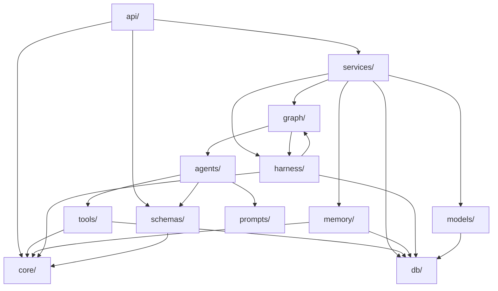

# Job Agent OS — 第五阶段：工程骨架（Project Skeleton）

---

## 依赖管理选型：uv + pyproject.toml

| 对比项 | uv + pyproject.toml | Poetry |
|--------|---------------------|--------|
| 速度 | 极快（Rust 实现，比 pip 快 10-100x） | 中等 |
| 标准兼容 | 完全遵循 PEP 621 pyproject.toml 标准 | 有私有 [tool.poetry] 扩展 |
| 锁文件 | uv.lock（跨平台确定性） | poetry.lock |
| 虚拟环境 | uv venv（自动管理） | poetry env |
| 与 Docker 集成 | 轻量，无需额外安装 | 需安装 poetry |
| 社区趋势 | 2024-2026 主流方向，Astral 维护 | 成熟但发展放缓 |

**结论：使用 uv + pyproject.toml（PEP 621 标准）**。理由：
1. 用户已指定 uv 管理依赖
2. pyproject.toml 是 Python 生态标准，无需 Poetry 私有格式
3. uv 速度极快，CI/CD 和 Docker 构建效率高
4. 兼容 pip、pip-tools 等所有标准工具

---

## 一、项目目录结构（Tree）

```
job-agent-os/
├── pyproject.toml                    # 项目元数据 + 依赖定义（PEP 621）
├── uv.lock                          # 依赖锁文件（uv 生成）
├── .python-version                  # Python 版本锁定（3.12）
├── .env.example                     # 环境变量模板
├── .gitignore
├── Makefile                         # 常用命令快捷入口
├── docker-compose.yml               # 本地开发环境编排
├── Dockerfile                       # 应用镜像构建
├── alembic.ini                      # 数据库迁移配置
│
├── src/
│   └── job_agent_os/                # 主包（可安装包名）
│       ├── __init__.py
│       ├── main.py                  # FastAPI 应用入口
│       ├── settings.py              # 全局配置（Pydantic Settings）
│       │
│       ├── api/                     # [接入层] REST API
│       │   ├── __init__.py
│       │   ├── deps.py              # 公共依赖注入（认证、DB Session、分页）
│       │   ├── middleware.py        # 中间件（CORS、请求日志、异常处理）
│       │   ├── response.py          # 统一响应模型
│       │   └── v1/                  # API v1 版本
│       │       ├── __init__.py
│       │       ├── router.py        # v1 总路由注册
│       │       ├── auth.py          # 认证端点
│       │       ├── users.py         # 用户端点
│       │       ├── resumes.py       # 简历端点
│       │       ├── jobs.py          # 岗位端点
│       │       ├── applications.py  # 投递端点
│       │       ├── sessions.py      # Agent 会话端点
│       │       ├── approvals.py     # 人工审批端点
│       │       ├── interview.py     # 面试准备端点
│       │       ├── memory.py        # 记忆管理端点
│       │       ├── evaluations.py   # 评估端点
│       │       ├── monitoring.py    # 监控端点
│       │       └── prompts.py       # Prompt 管理端点
│       │
│       ├── models/                  # [数据层] Pydantic 模型 + ORM
│       │   ├── __init__.py
│       │   ├── base.py              # ORM Base、通用 Mixin（时间戳、UUID）
│       │   ├── user.py              # User ORM + Schema
│       │   ├── resume.py            # Resume ORM + Schema
│       │   ├── job.py               # Job ORM + Schema
│       │   ├── application.py       # Application ORM + Schema
│       │   ├── agent_log.py         # AgentLog ORM + Schema
│       │   ├── prompt_version.py    # PromptVersion ORM + Schema
│       │   ├── tool_call.py         # ToolCall ORM + Schema
│       │   ├── human_approval.py    # HumanApproval ORM + Schema
│       │   ├── memory.py            # Memory ORM + Schema
│       │   └── evaluation.py        # Evaluation ORM + Schema
│       │
│       ├── schemas/                 # [契约层] 纯 Pydantic 请求/响应模型
│       │   ├── __init__.py
│       │   ├── common.py            # 通用 Schema（分页、响应包装）
│       │   ├── auth.py              # 认证相关 Schema
│       │   ├── user.py              # 用户 Schema
│       │   ├── resume.py            # 简历 Schema
│       │   ├── job.py               # 岗位 Schema（含 JobQuery、ParsedJD）
│       │   ├── application.py       # 投递 Schema
│       │   ├── session.py           # 会话 Schema
│       │   ├── approval.py          # 审批 Schema
│       │   ├── match.py             # 匹配结果 Schema（MatchScore）
│       │   ├── interview.py         # 面试题 Schema
│       │   ├── memory.py            # 记忆 Schema
│       │   └── evaluation.py        # 评估 Schema
│       │
│       ├── db/                      # [持久层] 数据库连接与迁移
│       │   ├── __init__.py
│       │   ├── session.py           # SQLAlchemy AsyncEngine + Session 工厂
│       │   ├── redis.py             # Redis 连接池
│       │   └── migrations/          # Alembic 迁移脚本
│       │       ├── env.py
│       │       ├── script.py.mako
│       │       └── versions/
│       │
│       ├── graph/                   # [编排层] LangGraph 图定义
│       │   ├── __init__.py
│       │   ├── state.py             # 全局 State 定义（TypedDict/Pydantic）
│       │   ├── main_graph.py        # 主流程 Graph 构建与编译
│       │   ├── nodes.py             # Node 注册表（Agent -> Node 映射）
│       │   ├── edges.py             # 条件边 / 路由函数
│       │   ├── checkpointer.py      # Checkpointer 配置（Postgres）
│       │   └── subgraphs/           # 子图（复杂 Agent 内部流程）
│       │       ├── __init__.py
│       │       └── search_subgraph.py
│       │
│       ├── agents/                  # [Agent 层] 各 Agent 实现
│       │   ├── __init__.py
│       │   ├── base.py              # Agent 基类 / 协议
│       │   ├── orchestrator.py      # Orchestrator Agent
│       │   ├── intent_agent.py      # Intent Agent
│       │   ├── search_agent.py      # Search Agent
│       │   ├── parse_agent.py       # Parse Agent
│       │   ├── match_agent.py       # Match Agent
│       │   ├── resume_agent.py      # Resume Agent
│       │   ├── interview_agent.py   # Interview Agent
│       │   └── tracker_agent.py     # Tracker Agent
│       │
│       ├── tools/                   # [Tool 层] Agent 可调用的工具
│       │   ├── __init__.py
│       │   ├── registry.py          # Tool 注册表（自动发现 + 按 Agent 分组）
│       │   ├── search/              # 搜索类 Tool
│       │   │   ├── __init__.py
│       │   │   ├── base.py          # PlatformAdapter 抽象基类
│       │   │   ├── boss.py          # BOSS 直聘适配器
│       │   │   ├── niuke.py         # 牛客适配器
│       │   │   └── guopin.py        # 国聘适配器
│       │   ├── parse/               # 解析类 Tool
│       │   │   ├── __init__.py
│       │   │   ├── html_parser.py
│       │   │   ├── pdf_parser.py
│       │   │   └── jd_structurer.py
│       │   ├── match/               # 匹配类 Tool
│       │   │   ├── __init__.py
│       │   │   ├── embedding_similarity.py
│       │   │   ├── rule_filter.py
│       │   │   └── skill_matcher.py
│       │   ├── resume/              # 简历类 Tool
│       │   │   ├── __init__.py
│       │   │   ├── resume_parser.py
│       │   │   ├── keyword_optimizer.py
│       │   │   └── pdf_exporter.py
│       │   ├── interview/           # 面试类 Tool
│       │   │   ├── __init__.py
│       │   │   ├── tech_question_gen.py
│       │   │   └── behavior_question_gen.py
│       │   └── common/              # 通用 Tool
│       │       ├── __init__.py
│       │       └── dedup.py
│       │
│       ├── prompts/                 # [Prompt 层] Prompt 模板管理
│       │   ├── __init__.py
│       │   ├── loader.py            # Prompt 加载器（文件/DB 双源）
│       │   ├── registry.py          # Prompt 注册表
│       │   └── templates/           # Prompt 模板文件（Jinja2/YAML）
│       │       ├── intent/
│       │       │   └── parse_intent.yaml
│       │       ├── parse/
│       │       │   └── structure_jd.yaml
│       │       ├── match/
│       │       │   └── score_and_rank.yaml
│       │       ├── resume/
│       │       │   └── optimize_resume.yaml
│       │       └── interview/
│       │           ├── tech_questions.yaml
│       │           └── behavior_questions.yaml
│       │
│       ├── memory/                  # [Memory 层] 记忆管理
│       │   ├── __init__.py
│       │   ├── store.py             # Memory Store 抽象 + 实现
│       │   ├── rag.py               # RAG 引擎（Embedding + Retrieval）
│       │   ├── embeddings.py        # Embedding 服务封装
│       │   └── vectorstore.py       # 向量数据库适配（pgvector/ChromaDB）
│       │
│       ├── harness/                 # [Harness 层] 运行时基础设施
│       │   ├── __init__.py
│       │   ├── runtime.py           # Harness Runtime 主入口（生命周期管理）
│       │   ├── execution_engine.py  # Graph 执行引擎封装
│       │   ├── trace_manager.py     # 全链路追踪
│       │   ├── guard_rails.py       # 护栏（Token/步数/循环/格式校验）
│       │   ├── budget_controller.py # Token 预算控制
│       │   ├── recovery_manager.py  # 错误恢复 / 断点续跑
│       │   ├── hitl_gateway.py      # Human-in-the-Loop 网关
│       │   └── eval/                # 评估框架
│       │       ├── __init__.py
│       │       ├── engine.py        # Eval 引擎
│       │       ├── metrics.py       # 评估指标定义
│       │       ├── judges.py        # 评判器（Rule/LLM/Human）
│       │       └── datasets/        # 评估数据集
│       │           └── .gitkeep
│       │
│       ├── services/                # [业务层] 业务逻辑编排
│       │   ├── __init__.py
│       │   ├── auth_service.py      # 认证业务逻辑
│       │   ├── user_service.py
│       │   ├── resume_service.py
│       │   ├── job_service.py
│       │   ├── application_service.py
│       │   ├── session_service.py   # Agent 会话管理（调用 Harness）
│       │   └── approval_service.py
│       │
│       └── core/                    # [核心层] 通用基础设施
│           ├── __init__.py
│           ├── security.py          # JWT 签发/验证、密码哈希
│           ├── exceptions.py        # 自定义异常体系
│           ├── error_codes.py       # 错误码定义
│           ├── events.py            # 事件总线（进程内）
│           └── utils.py             # 通用工具函数
│
├── tests/                           # 测试
│   ├── __init__.py
│   ├── conftest.py                  # pytest fixtures（DB、Redis、Client）
│   ├── unit/                        # 单元测试
│   │   ├── __init__.py
│   │   ├── test_agents/
│   │   ├── test_tools/
│   │   ├── test_harness/
│   │   └── test_services/
│   ├── integration/                 # 集成测试
│   │   ├── __init__.py
│   │   ├── test_api/
│   │   └── test_graph/
│   └── eval/                        # Agent 评估测试
│       ├── __init__.py
│       └── test_intent_eval.py
│
├── configs/                         # 配置文件
│   ├── settings.dev.yaml            # 开发环境配置
│   ├── settings.prod.yaml           # 生产环境配置
│   └── settings.test.yaml           # 测试环境配置
│
├── scripts/                         # 运维/工具脚本
│   ├── init_db.py                   # 初始化数据库（创建扩展等）
│   ├── seed_data.py                 # 填充测试数据
│   └── run_eval.py                  # 运行评估
│
└── docs/                            # 项目文档（仅架构级）
    └── architecture.md
```

---

## 二、每个目录职责

| 目录 | 职责 | 设计原则 |
|------|------|----------|
| `src/job_agent_os/` | 主应用包，所有业务代码根目录 | 可安装 Python 包（`pip install -e .`） |
| `api/` | HTTP 接入层：路由定义、请求校验、响应格式化 | 薄层，不含业务逻辑，只做转发 |
| `models/` | 数据模型层：SQLAlchemy ORM 模型 + 关联 Pydantic Schema | 一个表一个文件 |
| `schemas/` | 纯 Pydantic 契约：请求/响应/内部传输对象 | 无 DB 依赖，可独立使用 |
| `db/` | 数据库基础设施：连接管理、迁移 | 与业务解耦 |
| `graph/` | LangGraph 编排：State 定义、图构建、路由逻辑 | 只关心"如何连接 Agent"，不关心 Agent 内部 |
| `agents/` | Agent 实现：每个 Agent 单一职责 | 只关心"做什么"，不关心"何时被调用" |
| `tools/` | Tool 实现：Agent 可调用的外部能力 | 按领域分子目录，统一注册 |
| `prompts/` | Prompt 管理：模板文件 + 加载/版本控制 | 与代码分离，支持热更新 |
| `memory/` | 记忆系统：短期/长期/RAG | 对 Agent 透明，通过 Tool 或 Store 访问 |
| `harness/` | 运行时基础设施：追踪、护栏、恢复、评估、HITL | 包裹在 Graph 执行外层，非侵入式 |
| `services/` | 业务逻辑编排：连接 API 层与底层能力 | API 不直接调用 Agent/DB |
| `core/` | 通用基础设施：安全、异常、事件、工具 | 无业务依赖，任何模块可引用 |
| `tests/` | 测试代码 | 镜像 src 结构 |
| `configs/` | 多环境配置 | 环境变量优先，文件兜底 |
| `scripts/` | 一次性/运维脚本 | 不随应用部署 |

---

## 三、关键文件职责说明

| 文件 | 职责 |
|------|------|
| `main.py` | 创建 FastAPI app 实例、注册路由、挂载中间件、启动/关闭事件 |
| `settings.py` | 基于 pydantic-settings 的全局配置类，从环境变量/yaml 加载 |
| `api/deps.py` | FastAPI 依赖注入：get_db_session、get_current_user、get_pagination |
| `api/response.py` | 统一 JSON 响应包装（ApiResponse[T]、PaginatedResponse[T]） |
| `models/base.py` | SQLAlchemy DeclarativeBase + UUIDMixin + TimestampMixin |
| `db/session.py` | create_async_engine、async_sessionmaker、get_session 生成器 |
| `db/redis.py` | aioredis 连接池初始化 |
| `graph/state.py` | JobAgentState TypedDict 定义（全局共享状态） |
| `graph/main_graph.py` | 构建 StateGraph、注册 Node/Edge、编译为 CompiledGraph |
| `graph/edges.py` | 条件路由函数（如：信息是否完整、匹配分是否达标） |
| `graph/checkpointer.py` | PostgresSaver 配置（断点恢复） |
| `agents/base.py` | BaseAgent 协议/抽象类（统一 input/output/execute 接口） |
| `tools/registry.py` | Tool 自动发现 + 按 Agent 分组注册 + LangChain Tool 转换 |
| `tools/search/base.py` | PlatformAdapter ABC（search、parse_result 抽象方法） |
| `prompts/loader.py` | 从 YAML 文件/数据库加载 Prompt 模板，支持变量渲染 |
| `memory/store.py` | MemoryStore 接口 + PostgresMemoryStore 实现 |
| `memory/rag.py` | RAGPipeline（embed -> store -> retrieve -> rerank） |
| `harness/runtime.py` | HarnessRuntime 类：封装 Graph 执行 + 注入追踪/护栏/恢复 |
| `harness/guard_rails.py` | 中间件式拦截：Token 检查、步数检查、输出校验 |
| `harness/hitl_gateway.py` | 审批请求创建、状态查询、超时处理 |
| `services/session_service.py` | 创建会话 -> 调用 HarnessRuntime.execute -> 管理生命周期 |
| `core/exceptions.py` | 异常层级：AppException -> NotFound/Validation/Conflict/... |
| `core/error_codes.py` | 错误码枚举（与 API 设计阶段一致） |

---

## 四、模块依赖关系



**依赖规则（严格单向）：**
| 规则 | 说明 |
|------|------|
| api 不直接调用 agents/graph | 必须通过 services 层 |
| agents 不直接操作 DB | 通过 tools 或 memory 访问 |
| graph 不包含业务逻辑 | 只做编排（Node 注册 + 路由） |
| harness 不修改业务 State | 只读取/监控/拦截 |
| core 不依赖任何业务模块 | 纯基础设施 |
| schemas 不依赖 models | 契约独立于存储 |

---

## 五、LangGraph 组织方式

### 文件职责划分

| 文件 | 内容 |
|------|------|
| `graph/state.py` | 定义 `JobAgentState(TypedDict)` — 全局共享状态 |
| `graph/main_graph.py` | 构建 `StateGraph`，注册所有 Node 和 Edge，调用 `.compile()` |
| `graph/nodes.py` | Node 注册表：将 Agent 实例映射为 Graph Node 函数 |
| `graph/edges.py` | 条件路由函数集合（纯函数，输入 State 输出下一 Node 名） |
| `graph/checkpointer.py` | 配置 `AsyncPostgresSaver`（State 持久化 + 断点恢复） |
| `graph/subgraphs/` | 复杂 Agent 内部子流程（如 Search 的多平台并行子图） |

### Graph 构建伪结构

```
main_graph.py:
    1. 创建 StateGraph(JobAgentState)
    2. 添加 Node:
       - "intent"      -> intent_agent.execute
       - "search"      -> search_agent.execute
       - "parse"       -> parse_agent.execute
       - "match"       -> match_agent.execute
       - "resume"      -> resume_agent.execute
       - "interview"   -> interview_agent.execute
       - "tracker"     -> tracker_agent.execute
       - "human_*"     -> hitl_gateway 中断节点
    3. 添加 Edge:
       - START -> "intent"
       - "intent" -> conditional(is_complete?) -> "search" / "human_clarify"
       - "search" -> "parse"
       - "parse" -> "match"
       - "match" -> "human_review"
       - "human_review" -> conditional(approved?) -> "resume" / "match"
       - "resume" -> "human_approve"
       - "human_approve" -> conditional(approved?) -> "interview" / "resume"
       - "interview" -> "tracker"
       - "tracker" -> END
    4. compile(checkpointer=postgres_saver, interrupt_before=["human_*"])
```

### 关键设计决策

| 决策 | 选择 | 理由 |
|------|------|------|
| State 类型 | TypedDict + Annotated Reducers | LangGraph 原生支持，类型安全 |
| Node 粒度 | 一个 Agent = 一个 Node | 职责单一，便于追踪和重试 |
| 子图 | 仅 Search Agent 使用子图 | 多平台并行搜索需要内部编排 |
| Checkpointer | AsyncPostgresSaver | 与主 DB 统一，支持断点恢复 |
| HITL | interrupt_before + 独立 human Node | LangGraph 原生机制 |

---

## 六、Harness Runtime 位置与结构

**位置：`src/job_agent_os/harness/`**

### 与 Graph 的关系

```
services/session_service.py
    └── 调用 harness/runtime.py::HarnessRuntime.execute(graph, state, config)
            ├── 注入 trace_manager（Callback）
            ├── 注入 guard_rails（前置/后置检查）
            ├── 注入 budget_controller（Token 计量）
            ├── 调用 graph.ainvoke(state, config)
            ├── 异常时调用 recovery_manager
            └── 记录 execution_log 到 DB
```

### 各文件职责

| 文件 | 职责 | 实现方式 |
|------|------|----------|
| `runtime.py` | 统一执行入口，组合所有 Harness 组件 | 门面模式 |
| `execution_engine.py` | 封装 CompiledGraph 调用，管理并发会话 | 包装 LangGraph invoke |
| `trace_manager.py` | 全链路追踪（每步 input/output/耗时/Token） | LangGraph Callbacks + OTel |
| `guard_rails.py` | 前置/后置拦截器（Token/步数/循环/格式） | 中间件链模式 |
| `budget_controller.py` | Token 预算检查与降级策略 | 读取 DB 配额 + 实时计数 |
| `recovery_manager.py` | 失败重试、Checkpoint 回滚、模型降级 | 策略模式 |
| `hitl_gateway.py` | 审批请求 CRUD、超时调度、WebSocket 通知 | 与 approval_service 协作 |
| `eval/engine.py` | 评估执行器（采样/批量/回归） | 调用 judges + 写入 evaluation 表 |
| `eval/metrics.py` | 指标定义（准确率/覆盖率/一致性） | 纯函数 |
| `eval/judges.py` | 评判器（Rule-based / LLM-as-Judge） | 策略模式 |

---

## 七、Agent 位置与组织

**位置：`src/job_agent_os/agents/`**

### 设计原则

| 原则 | 说明 |
|------|------|
| 单一职责 | 一个文件 = 一个 Agent = 一个 Node |
| 统一接口 | 继承 `base.py::BaseAgent`，实现 `async execute(state) -> partial_state` |
| 无状态 | Agent 本身不持有状态，所有数据通过 State 传入传出 |
| 可测试 | 每个 Agent 可独立实例化 + 单测（mock tools） |
| 声明式 Tool 绑定 | Agent 声明自己需要哪些 Tools，由 registry 注入 |

### base.py 定义的结构

```
BaseAgent (ABC):
    - name: str                    # Agent 名称
    - required_tools: list[str]    # 需要的 Tool 名称列表
    - prompt_key: str              # 使用的 Prompt 标识
    - async execute(state: JobAgentState) -> dict   # 核心执行方法
    - _build_prompt(state) -> str  # 构建 Prompt
    - _parse_output(raw) -> dict   # 解析 LLM 输出
```

---

## 八、Tool 位置与组织

**位置：`src/job_agent_os/tools/`**

### 组织方式

| 层级 | 说明 |
|------|------|
| `tools/registry.py` | 全局 Tool 注册表，自动发现子目录中的 Tool |
| `tools/{domain}/` | 按领域分子目录（search/parse/match/resume/interview/common） |
| `tools/{domain}/base.py` | 领域抽象基类（如 PlatformAdapter） |
| `tools/{domain}/{impl}.py` | 具体实现 |

### Tool 规范

每个 Tool 必须：
- 使用 `@tool` 装饰器（LangChain）或继承自定义 BaseTool
- 定义 Pydantic 输入/输出 Schema
- 声明超时、重试配置
- 注册到 registry（通过装饰器自动完成）

### 扩展方式

新增招聘平台：
1. 在 `tools/search/` 下新建 `{platform}.py`
2. 继承 `PlatformAdapter`
3. 实现 `search()` 和 `parse_result()` 方法
4. 自动被 registry 发现，无需修改其他代码

---

## 九、Prompt 位置与组织

**位置：`src/job_agent_os/prompts/`**

### 设计

| 组件 | 说明 |
|------|------|
| `templates/` | YAML 格式的 Prompt 模板文件（按 Agent 分子目录） |
| `loader.py` | 加载器：从 YAML 文件读取 + 变量渲染（Jinja2） |
| `registry.py` | 注册表：管理 active 版本，支持从 DB 热加载 |

### YAML 模板格式

```yaml
# templates/intent/parse_intent.yaml
key: intent_parse
version: 1
model: gpt-4o
temperature: 0.1
max_tokens: 2048
system: |
  你是一个求职意向解析专家...
user_template: |
  用户输入: {{ user_input }}
  历史偏好: {{ preferences }}
  请解析为结构化 JSON...
output_schema:
  type: object
  properties:
    region: {type: array}
    ...
```

### 版本管理策略

- 开发阶段：从 YAML 文件加载（Git 版本控制）
- 生产阶段：从 `prompt_versions` 表加载（支持 A/B 测试）
- loader 支持 fallback：DB 无记录时回退到文件

---

## 十、Memory 位置与组织

**位置：`src/job_agent_os/memory/`**

### 架构

| 文件 | 职责 |
|------|------|
| `store.py` | MemoryStore 抽象接口 + PostgresMemoryStore 实现（读写 memory 表） |
| `rag.py` | RAGPipeline：文档分段 -> Embedding -> 存储 -> 检索 -> 重排 |
| `embeddings.py` | Embedding 服务封装（OpenAI / 本地模型，可切换） |
| `vectorstore.py` | 向量存储适配器（pgvector 为主，ChromaDB 为备选） |

### Memory 访问方式

| 访问者 | 方式 | 说明 |
|--------|------|------|
| Agent（运行时） | 通过 LangGraph State | 短期记忆在 State 中流转 |
| Agent（跨会话） | 通过 MemoryStore Tool | 调用 `query_history_loader` 等 Tool |
| RAG 检索 | 通过 RAGPipeline Tool | 调用 `embedding_similarity` 等 Tool |
| API 层 | 通过 memory_service | 用户手动管理记忆 |

### 与 LangGraph 的集成

- **Checkpointer**（`graph/checkpointer.py`）：负责 State 持久化（短期记忆）
- **MemoryStore**（`memory/store.py`）：负责跨会话长期记忆
- **VectorStore**（`memory/vectorstore.py`）：负责语义检索（RAG）

三者独立但协作：Checkpointer 管"流程恢复"，MemoryStore 管"用户偏好"，VectorStore 管"语义匹配"。

---

## 十一、Docker 与基础设施

### docker-compose.yml 服务

| 服务 | 镜像 | 用途 |
|------|------|------|
| app | 自建（Dockerfile） | FastAPI 应用 |
| postgres | postgres:16 + pgvector | 主数据库 |
| redis | redis:7-alpine | 缓存 + 会话 + 限流 |
| worker | 同 app 镜像 | 后台任务（搜索、解析） |

### Dockerfile 要点

- 基础镜像：`python:3.12-slim`
- 使用 uv 安装依赖（`uv sync --frozen`）
- 多阶段构建（builder + runtime）
- 非 root 用户运行

---

## 十二、pyproject.toml 核心依赖

| 类别 | 依赖 |
|------|------|
| Web 框架 | fastapi, uvicorn[standard], python-multipart |
| LangGraph | langgraph, langchain-core, langchain-openai |
| 数据校验 | pydantic>=2.0, pydantic-settings |
| ORM | sqlalchemy[asyncio]>=2.0, asyncpg, alembic |
| Redis | redis[hiredis] |
| 向量 | pgvector |
| 认证 | python-jose[cryptography], passlib[bcrypt] |
| HTTP 客户端 | httpx |
| 爬虫 | playwright, beautifulsoup4 |
| 可观测 | opentelemetry-sdk, langsmith |
| 测试 | pytest, pytest-asyncio, pytest-cov, httpx |
| 开发 | ruff, mypy, pre-commit |

---

## 十三、实施步骤（骨架阶段）

| 步骤 | 内容 | 产出 |
|------|------|------|
| 1 | 初始化项目：uv init + pyproject.toml + .python-version | 可运行的空项目 |
| 2 | 创建目录结构：所有目录 + `__init__.py` | 完整骨架 |
| 3 | 核心配置：settings.py + configs/*.yaml + .env.example | 配置可加载 |
| 4 | 数据库基础：db/session.py + models/base.py + alembic init | DB 可连接 |
| 5 | FastAPI 入口：main.py + api/response.py + api/deps.py | 健康检查可访问 |
| 6 | LangGraph 骨架：graph/state.py + graph/main_graph.py（空 Node） | Graph 可编译 |
| 7 | Harness 骨架：harness/runtime.py（空壳） | 结构就位 |
| 8 | Docker：Dockerfile + docker-compose.yml | 一键启动开发环境 |
| 9 | 测试基础：tests/conftest.py + 一个 smoke test | pytest 可运行 |
| 10 | Makefile + scripts | 常用命令快捷方式 |
