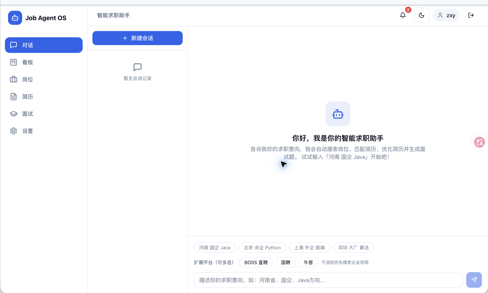
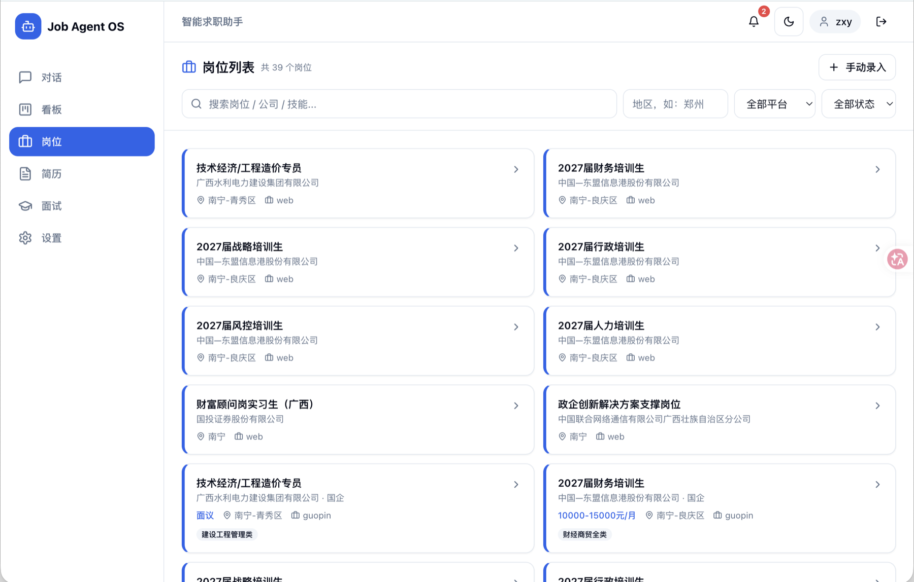
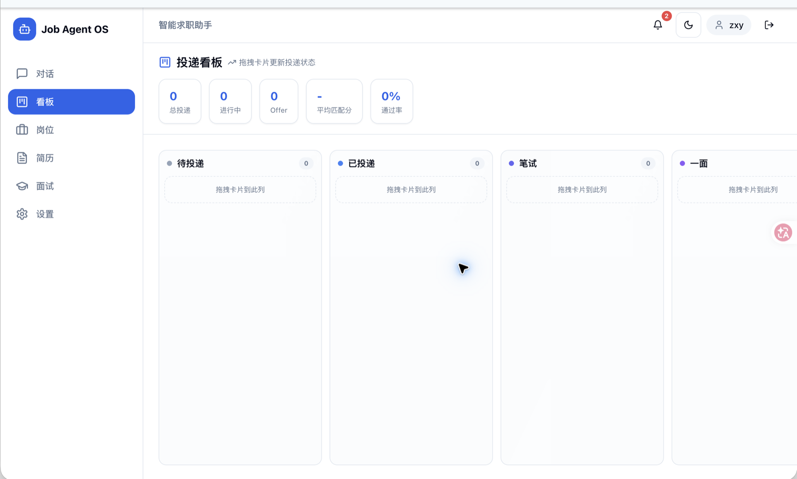
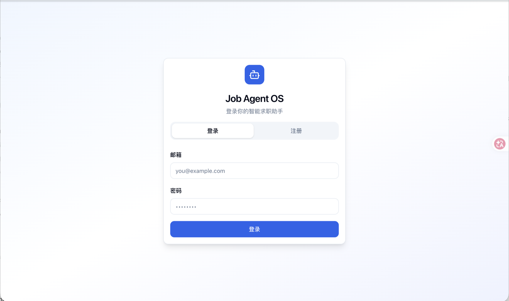
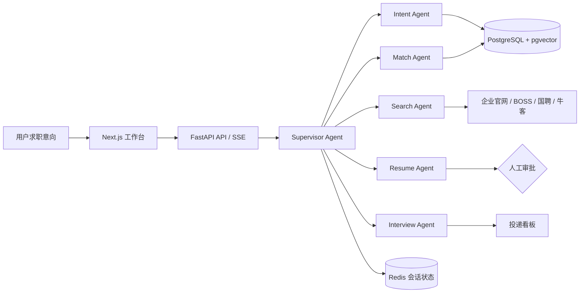

# Job Agent OS

<div align="center">

[](https://www.python.org/)
[](https://fastapi.tiangolo.com/)
[](https://github.com/langchain-ai/langgraph)
[](https://nextjs.org/)
[](https://github.com/pgvector/pgvector)
[](job-agent-os/LICENSE)

**面向求职全流程的 Multi-Agent 智能协同系统**

从自然语言求职意向出发，自动完成岗位搜索、人岗匹配、简历优化、面试准备与投递跟踪。

[功能特性](#核心功能) · [系统截图](#系统截图) · [系统架构](#系统架构) · [快速开始](#快速开始) · [完整文档](job-agent-os/README.md)

</div>

---



## 项目简介

Job Agent OS 使用 LangGraph 编排多个专业智能体，将分散的求职任务组织成一条可追踪、可恢复、可人工审批的工作流。用户只需描述目标地区、企业类型和岗位方向，系统即可逐步生成从岗位推荐到面试准备的完整求职方案。

项目采用前后端分离架构：Next.js 提供交互式工作台，FastAPI 承载业务 API，PostgreSQL + pgvector 保存业务数据与长期记忆，Redis 负责会话状态及缓存。

## 核心功能

- **求职意图解析**：从自然语言中提取地区、企业性质、岗位方向、薪资等条件，并在信息不足时进行多轮澄清。
- **多源岗位搜索**：优先检索企业官网，同时支持 BOSS 直聘、国聘、牛客等扩展平台。
- **人岗匹配与解释**：从技能、学历、经验和地点四个维度评分，并保留匹配明细与风险提示。
- **定向简历优化**：针对用户确认的目标岗位生成优化版本、修改建议与差异对比。
- **面试准备**：并发生成岗位技术题和 STAR 行为面试题。
- **投递看板**：通过可拖拽看板管理待投递、已投递、笔试、面试与 Offer 状态。
- **工程治理**：内置执行追踪、Token 预算、循环护栏、失败恢复、输出校验与人工审批。

## 系统截图

### 岗位聚合与搜索



### 投递进度看板



<details>
<summary>查看登录界面</summary>



</details>

## 系统架构



## 智能体协作

| Agent | 职责 |
|---|---|
| Supervisor | 规则优先调度、异常重规划与流程收敛 |
| Intent | 求职意图解析、偏好补全与多轮澄清 |
| Search | 官网优先搜索、多平台聚合与 JD 并发解析 |
| Match | 多维规则评分、硬条件过滤与解释性推荐 |
| Resume | 基于确认岗位进行简历定向优化 |
| Interview | 生成技术题与行为题，并初始化投递跟踪 |

## 技术栈

- Python 3.12、FastAPI、LangGraph、LangChain
- Next.js 14、TypeScript、Tailwind CSS、Zustand
- PostgreSQL 16、pgvector、SQLAlchemy、Alembic
- Redis、Playwright、OpenTelemetry、Langfuse
- uv、Pytest、Ruff、MyPy、Docker Compose

## 快速开始

### Docker Compose

```bash
git clone https://github.com/zzz390/mult-agent-job.git
cd mult-agent-job/job-agent-os
cp .env.example .env

# 编辑 .env，配置 JWT 与模型 API Key
docker compose up -d
```

启动后访问：

- 前端工作台：<http://localhost:3000>（前端需在 `frontend` 目录单独启动）
- 后端 API：<http://localhost:8000>
- Swagger 文档：<http://localhost:8000/docs>

### 本地开发

```bash
cd job-agent-os
uv sync
uv run playwright install chromium

docker compose up -d postgres redis
uv run alembic upgrade head
uv run uvicorn job_agent_os.main:app --reload
```

另开终端启动前端：

```bash
cd job-agent-os/frontend
npm install
npm run dev
```

## 项目目录

```text
mult-agent-job/
└── job-agent-os/
    ├── frontend/              # Next.js 前端工作台
    ├── src/job_agent_os/
    │   ├── agents/            # 领域智能体
    │   ├── graph/             # LangGraph 工作流
    │   ├── harness/           # 预算、护栏、追踪与恢复
    │   ├── memory/            # 长期记忆与 RAG
    │   ├── services/          # 业务服务
    │   └── tools/             # 搜索、解析、匹配工具
    ├── tests/                 # 单元与集成测试
    └── docker-compose.yml
```

更多配置、API 路由和工程命令请查看 [完整项目文档](job-agent-os/README.md)。

## License

本项目基于 [MIT License](job-agent-os/LICENSE) 开源。
