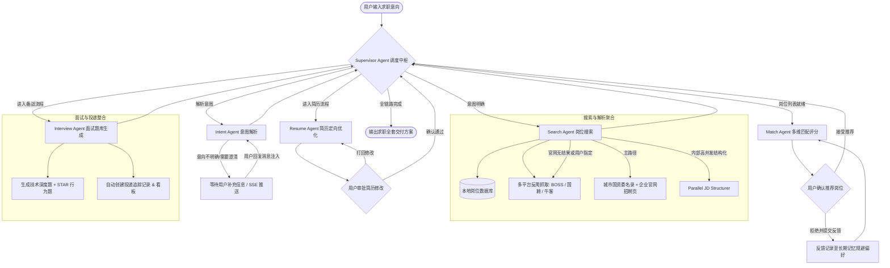

# Job Agent OS — 基于 Multi-Agent 架构的智能求职操作系统

<div align="center">

[](https://www.python.org/)
[](https://fastapi.tiangolo.com/)
[](https://github.com/langchain-ai/langgraph)
[](https://www.postgresql.org/)
[](https://redis.io/)
[](https://nextjs.org/)
[](LICENSE)

**面向应届生秋招与职场求职的全流程 Multi-Agent 智能协同系统**

[项目特点](#-核心特性) • [系统架构](#-系统架构) • [Agent 矩阵](#-智能体矩阵) • [快速开始](#-快速开始) • [API 文档](#-api-端点速查) • [工程命令](#-常用工程命令)

</div>

---

## 📖 项目简介

**Job Agent OS** 是一个专为求职者（特别是应届生秋招）打造的企业级多智能体协同操作系统。用户只需输入一段简单的自然语言求职意向（例如：*“河南或北京、国企央企、计算机相关、Java/后端方向”*），系统即可自主调度多个专业 Agent 协作完成：

1. **求职意图解析与多轮追问澄清**（结合长期偏好记忆）
2. **全网多平台岗位智能检索与反爬抓取**（本地库 + BOSS直聘 + 国聘网 + 牛客网 + 企业官网）
3. **海量 JD 毫秒级并发结构化解析**（技能点、学历要求、薪资、岗位职责）
4. **多维度人岗精准匹配与推荐打分**（技能 50% + 学历 20% + 经验 20% + 地点 10%，并保留可解释明细）
5. **针对目标岗位的定制化简历优化与 Diff 生成**（支持人机协作审批）
6. **个性化面试题库生成**（岗位技术深度题 + STAR 法则行为面试题）
7. **自动化投递看板全流程追踪**（待投递、笔试、各轮面试、Offer 全生命周期管理）

---

## 🌟 核心特性

- 🧠 **Supervisor 规则优先编排**：基于 LangGraph StateGraph 构建集中式调度环路；正常流程采用确定性路由，仅在异常或未知模式下调用 LLM 重规划，减少延迟、成本与路由漂移。
- 🕷️ **高可用反爬抓取引擎**：集成 Playwright 动态无头渲染、桌面端 User-Agent 随机池、Cookie/登录态注入、代理池轮换、进程级全局速率限制以及城市代码（City Code）动态映射。
- ⚡ **高并发 JD 结构化流水线**：采用 `asyncio.gather` 与信号量隔离技术，海量岗位并发解析清洗，避免 LLM 串行调用延迟瓶颈。
- 🔄 **闭环多轮交互与 SSE 实时推流**：支持在 LangGraph 运行中断点唤醒与增量状态注入，搭配 Server-Sent Events (SSE) 实现后端 Agent 执行进度的毫秒级流式推送。
- 💾 **混合存储与记忆全生命周期**：
  - **短期记忆**：LangGraph Checkpointer 会话状态快照与回滚。
  - **会话持久化**：基于 Redis 的 `SessionStore`（带 7 天 TTL 与本地内存写透缓存）。
  - **长期记忆**：PostgreSQL + pgvector 向量检索与分类存储（用户偏好、历史推荐、反馈约束），后台定时执行记忆老化清理。
- 🛡️ **生产级 Harness 治理工程**：具备全链路 Trace 追踪、Token 实时精确计量累加（Reducer 机制）、循环步数护栏（GuardRails）、Token 预算熔断与错误恢复机制。

---

## 🏗️ 系统架构

### 1. 分层架构设计

```
┌─────────────────────────────────────────────────────────┐
│                    接入层 (api/)                          │
│         FastAPI REST API + SSE 实时流式 + JWT 鉴权        │
├─────────────────────────────────────────────────────────┤
│                    业务层 (services/)                     │
│    SessionService / ResumeService / ApplicationService  │
├─────────────────────────────────────────────────────────┤
│                    编排层 (graph/)                        │
│    LangGraph StateGraph + 动态条件路由 + Checkpointer    │
├─────────────────────────────────────────────────────────┤
│                    智能体层 (agents/)                     │
│  Supervisor / Intent / Search / Match / Resume / Interview │
├─────────────────────────────────────────────────────────┤
│                    工具与爬虫层 (tools/)                  │
│    PlatformAdapter (Playwright) / JDStructurer / ...    │
├─────────────────────────────────────────────────────────┤
│                    记忆与 RAG 层 (memory/)                │
│    PostgresMemoryStore / RAGPipeline / pgvector Embed   │
├─────────────────────────────────────────────────────────┤
│                    Harness 治理层 (harness/)             │
│    TraceManager / GuardRails / BudgetController / Eval  │
├─────────────────────────────────────────────────────────┤
│                    持久层 (db/ + models/)                 │
│         PostgreSQL 16 + Redis 7 + Alembic 迁移           │
└─────────────────────────────────────────────────────────┘
```

### 2. Multi-Agent 协作工作流 (DAG)



---

## 🤖 智能体矩阵

| 智能体名称 | 运行模式 | 核心职责 | 调用工具 / 关联服务 |
|---|---|---|---|
| **Supervisor Agent** | Rule-first + LLM Replan | 总指挥中枢，正常路径按状态确定性路由；仅在异常或未知模式下调用 LLM 重规划。 | 状态路由、错误恢复、循环熔断 |
| **Intent Agent** | ReAct / Parsing | 提取地区、企业性质、方向、薪资等结构化条件，结合用户历史偏好记忆辅助解析。 | `intent_keywords.yaml` 配置库、历史偏好语义召回 |
| **Search Agent** | Official-first + Bounded Concurrency | 先查城市国资委/政府名录与企业官网；官网无结果或用户指定时再访问第三方平台，并在内部并发完成 JD 结构化。 | 官网搜索、`boss_search`, `guopin_search`, `niuke_search`, `structure_jds_parallel` |
| **Match Agent** | Deterministic Scoring | 按技能 50%、学历 20%、经验 20%、地点 10% 解释性评分，并对明确的学历/地点冲突执行硬过滤。 | 规则评分、维度明细、风险与置信度 |
| **Resume Agent** | Direct Generation | 只基于用户确认的岗位调用一次简历优化，输出优化稿、差异与建议；受超时、预算和降级模型控制。 | `resume_optimizer` |
| **Interview Agent** | Parallel Generation + Inline Track | 针对同一确认岗位并发生成技术题与行为题，并创建投递记录和看板。 | `tech_question_gen`, `behavior_question_gen`, 投递看板初始化 |

主图固定为以上 **6 个智能体**。原 `web_search`、`parse`、`tracker` 实现仍保留作兼容能力，但不再注册为可路由的独立智能体；相关职责已分别并入 Search 与 Interview。

---

## 🛠️ 技术栈清单

- **编程语言**：Python 3.12（全异步 Asyncio 驱动）
- **Web 框架**：FastAPI 0.115+ + Uvicorn
- **Agent 框架**：LangGraph 0.2+ / LangChain Core / LangChain OpenAI
- **大语言模型**：DeepSeek (Pro / Flash 分级调度) / OpenAI GPT-4o 系列
- **数据持久化**：PostgreSQL 16（SQLAlchemy 2.0 Async + asyncpg + Alembic）
- **向量数据库**：pgvector 0.3+（支持 HNSW / IVFFlat 高维语义索引）
- **缓存与状态**：Redis 7（hiredis 驱动，会话持久化与全局频控）
- **网页渲染与抓取**：Playwright 1.45+ (Chromium 无头模式) + BeautifulSoup4
- **前端架构**：Next.js 14 (App Router) + TypeScript + TailwindCSS + Lucide Icons
- **可观测与评估**：OpenTelemetry + Langfuse + 自研 TraceManager
- **包管理与质量工具**：uv、Ruff（Lint & Format）、MyPy（Strict 静态类型检查）、Pytest

---

## 📁 目录结构

```
job-agent-os/
├── src/job_agent_os/
│   ├── main.py                 # FastAPI 入口、中间件与 Lifespan 生命周期管理
│   ├── settings.py             # 基于 Pydantic Settings 的全局强类型配置
│   ├── api/                    # 接入层：RESTful 路由、依赖注入、统一响应
│   │   ├── deps.py             # 鉴权用户、数据库 Session、分页依赖
│   │   └── v1/                 # 12 个业务 API 模块 (sessions, jobs, resumes, ...)
│   ├── agents/                 # 智能体层：Supervisor 及各领域 Specialist Agents
│   │   ├── base.py             # BaseAgent 抽象基类（ReAct 循环、Token 统计、容灾）
│   │   ├── supervisor.py       # 调度总控 Agent
│   │   └── ...                 # intent, search, match, resume, interview（核心主图共 6 个）
│   ├── graph/                  # 编排层：LangGraph 工作流构建与状态机
│   │   ├── state.py            # JobAgentState 定义与自定义 Reducer (add_token_usage 等)
│   │   ├── main_graph.py       # 工作流图构建、编译与 Checkpointer 挂载
│   │   └── nodes.py / edges.py # 节点执行体与条件路由分支
│   ├── tools/                  # 工具层：平台适配器、解析器与匹配打分工具
│   │   ├── search/             # 平台搜索 (PlatformAdapter, boss, guopin, niuke)
│   │   ├── parse/              # JD 结构化解析 (jd_structurer 高并发实现)
│   │   └── match/              # 向量匹配、技能匹配与硬性规则过滤
│   ├── memory/                 # 记忆与 RAG 层
│   │   ├── store.py            # PostgresMemoryStore (长期记忆持久化与向量检索)
│   │   ├── rag.py              # 简历与 JD 分块向量化检索管道
│   │   └── embeddings.py       # 文本向量化嵌入客户端
│   ├── harness/                # 工程治理层 (Trace, GuardRails, Budget, Recovery, Eval)
│   ├── services/               # 业务逻辑层 (session, resume, user, cleanup, ...)
│   ├── models/                 # SQLAlchemy ORM 数据模型 (users, jobs, resumes, ...)
│   ├── schemas/                # Pydantic 接口请求与响应 DTO 模型
│   └── configs/                # 动态配置 (intent_keywords.yaml, boss_city_codes.yaml)
├── frontend/                   # Next.js 14 前端可视化看板与交互界面
├── tests/                      # 测试套件 (unit, integration, eval)
├── scripts/                    # 数据库初始化种子数据等运维脚本
├── Dockerfile                  # 多阶段构建生产容器
├── docker-compose.yml          # 本地基础设施编排 (PostgreSQL + pgvector, Redis, Web)
├── pyproject.toml              # 项目依赖与 Ruff / MyPy / Pytest 配置
└── Makefile                    # 开发与运维常用指令集
```

---

## 🚀 快速开始

### 1. 前置环境要求

- **Python**: 3.12+
- **包管理工具**: [uv](https://github.com/astral-sh/uv) (推荐) 或 `pip`
- **容器环境**: Docker & Docker Compose
- **Node.js**: 18+ (如需运行前端)

### 2. 本地克隆与配置

```bash
# 克隆项目仓库（当前仓库使用单仓库子目录结构）
git clone https://github.com/zzz390/mult-agent-job.git
cd mult-agent-job/job-agent-os

# 复制环境变量配置文件
cp .env.example .env

# 编辑 .env 文件，填入您的 LLM API Key (如 DeepSeek / OpenAI)
# OPENAI_API_KEY=sk-xxxxxx
# OPENAI_BASE_URL=https://api.deepseek.com/v1
# OPENAI_MODEL=deepseek-v4-pro
# OPENAI_MODEL_FALLBACK=deepseek-v4-flash
```

### 3. 使用 Docker Compose 一键启动

```bash
# 启动后端、PostgreSQL（含 pgvector）与 Redis
make docker-up

# 查看后端日志
make docker-logs
```

后端启动后可访问：

- API 服务：<http://localhost:8000>
- Swagger 文档：<http://localhost:8000/docs>
- 健康检查：<http://localhost:8000/health>

### 4. 本地开发方式

```bash
# 安装 Python 依赖 (使用 uv)
uv sync

# 安装 Playwright 浏览器内核 (用于爬虫无头渲染)
uv run playwright install chromium

# 只启动本地开发所需的数据库与 Redis
docker compose up -d postgres redis

# 执行数据库迁移
make migrate

# 填充测试/演示基础数据 (可选)
make seed
```

### 5. 启动后端开发服务

```bash
make dev
# 服务将在 http://localhost:8000 启动
# API Swagger 交互式文档: http://localhost:8000/docs
```

### 6. 启动前端界面 (可选)

```bash
cd frontend
npm install
npm run dev
# 前端将在 http://localhost:3000 启动
```

---

## 🌐 API 端点速查

| 模块 | 方法 | 路由路径 | 说明 |
|---|---|---|---|
| **认证** | `POST` | `/v1/auth/register` | 注册用户 |
| | `POST` | `/v1/auth/login` | 登录并获取访问令牌 |
| **会话管理** | `POST` | `/v1/sessions` | 创建并异步启动智能求职 Agent 会话 |
| | `GET` | `/v1/sessions` | 获取当前用户的历史会话列表 |
| | `GET` | `/v1/sessions/{id}` | 获取指定会话详情及当前执行阶段 |
| | `POST` | `/v1/sessions/{id}/messages` | **多轮交互**：向会话发送补充信息或澄清答案 |
| | `GET` | `/v1/sessions/{id}/stream` | **SSE 流式接口**：实时监听 Agent 步骤与状态推送 |
| | `POST` | `/v1/sessions/{id}/cancel` | 取消正在执行的 Agent 任务 |
| | `GET` | `/v1/sessions/{id}/timeline`| 获取会话全流程时间线事件 |
| **岗位与推荐** | `GET` | `/v1/jobs` | 分页查询与筛选库内岗位 |
| | `GET` | `/v1/sessions/{id}/recommendations` | 获取会话输出的最终推荐岗位列表 |
| | `POST` | `/v1/sessions/{id}/recommendations/feedback` | 提交对推荐岗位的偏好/拒绝反馈 |
| **简历服务** | `POST` | `/v1/resumes` | 创建或上传用户简历 |
| | `GET` | `/v1/resumes` | 获取当前用户的简历列表 |
| **记忆体系** | `POST` | `/v1/memory/search` | 基于 pgvector 对长期记忆进行语义检索 |
| | `GET` | `/v1/memory` | 分页获取用户长期偏好与反馈记忆 |
| **投递管理** | `GET` | `/v1/applications` | 获取投递记录与看板状态数据 |
| | `PATCH`| `/v1/applications/{id}/status` | 推进投递卡片状态（如笔试、面试等） |

---

## 🧪 常用工程命令

项目提供了完善的 `Makefile` 指令集以简化日常开发流程：

```bash
make help          # 查看所有可用指令
make dev           # 启动本地 FastAPI 开发服务器 (热重载)
make test          # 运行 pytest 单元测试与覆盖率统计
make lint          # 运行 ruff 语法检查与 mypy 严格类型检查
make format        # 使用 ruff 自动格式化代码
make migrate       # 运行 Alembic 数据库升级迁移
make revision msg="add_field" # 自动生成 Alembic 迁移脚本
make seed          # 注入测试初始化数据
make docker-up     # 启动后台 Docker 容器 (PostgreSQL, Redis)
make docker-down   # 停止 Docker 容器
make clean         # 清理 Python 编译缓存与临时测试文件
```

---

## 📄 开源许可证

本项目基于 [MIT License](LICENSE) 开源发布。
